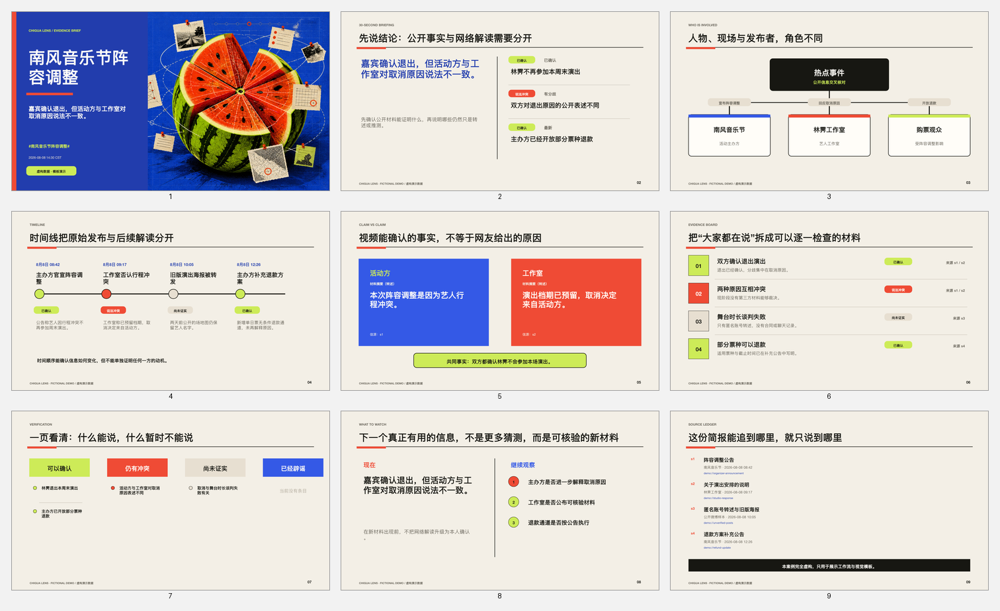

# 吃瓜神器 Chigua Lens

> 把热搜变成可追溯的 9 页简报：先用 30 秒抓住结论，再沿时间线、说法对照和信源台账逐条复核。



吃瓜神器不是“自动编八卦”的生成器，而是一套面向微博热点阅读的公开信息整理工作流。它把散落在热搜页、原帖、视频、公告和报道中的材料拆开，区分事实、转述与网络解读，再生成可编辑、可追溯的中文吃瓜简报。

## 30 秒看懂它做什么

- **输入**：一个热搜词、微博链接、截图、视频或一组公开材料。
- **处理**：建立信源池，整理人物关系与时间线，并把内容标记为已确认、说法冲突、尚未证实或已辟谣。
- **输出**：9 页可编辑 PowerPoint、Markdown 信源台账和可复用的 `dossier.json`。
- **复核**：关键判断绑定 `sourceIds`，每页演讲者备注保留 `[Sources]`，无法确认的内容不会被改写成肯定句。

## 两种使用形态

### Codex Skill：处理真实热点

[`skills/chigua-deck`](skills/chigua-deck/) 是完整工作流入口。把热搜词、链接或本地材料交给 Codex，Skill 会完成信源整理、证据分级、结构化和 PPT 生成；遇到真实人物时优先寻找当事人原帖、机构公告和可核验报道。

安装时可以克隆本仓库后，将 `skills/chigua-deck` 复制到本机 Codex 的 Skills 目录；也可以直接在本项目中让 Codex 阅读该目录的 `SKILL.md`。安装完成后用 `$chigua-deck` 显式调用。

最简提示词：

```text
使用 $chigua-deck 梳理 #某个热搜#。
请把已确认、说法冲突、尚未证实和已辟谣的内容分开，
生成 9 页可编辑 PPT、信源台账和 dossier.json。
```

只有截图或视频时：

```text
使用 $chigua-deck 分析这些材料。
先寻找原帖和公开信源；无法取得完整上下文的内容标记为尚未证实，
不要从沉默、删除或单个片段推断人物动机。
```

如果本机已经安装并授权 weibo-cli，Skill 可以先检查当前账号实际可用的只读命令；没有 weibo-cli 时，也可以继续使用公开网页、搜索结果和用户提供的材料。公开网页 Demo 本身不调用 weibo-cli，也不需要微博账号权限。

### 网页 Demo：体验产品形态

根目录的 `app/` 是一个**固定虚构案例的概念 Demo**，用于展示输入、时间线、证据卡、来源详情和长图导出的交互形式。它不会抓取任意热搜，也不会把输入内容发送给微博；真实热点应使用 Codex Skill 处理。

- GitHub Pages 在线地址：[https://nutllwhy.github.io/chigua-lens/](https://nutllwhy.github.io/chigua-lens/)
- 开源仓库：[https://github.com/nutllwhy/chigua-lens](https://github.com/nutllwhy/chigua-lens)
- 本地运行：

```bash
npm install
npm run dev
```

完整验证：

```bash
npm test
```

## 九页简报结构

| 页码 | 表现形式 | 读者得到什么 |
| --- | --- | --- |
| 01 | 事件封面 | 一句话看清事件与核心矛盾 |
| 02 | 30 秒摘要 | 已知事实、争议点与判断边界 |
| 03 | 人物关系 | 当事人、发布者、活动方与事件中心的关系 |
| 04 | 时间线 | 原始发布如何演变为热搜与后续回应 |
| 05 | 说法对照 | 并列展示各方公开说法，不替读者裁决 |
| 06 | 证据板 | 把关键材料拆成逐条可核对的证据卡 |
| 07 | 信息鉴定 | 集中展示已确认、冲突、未证实和已辟谣内容 |
| 08 | 下一步观察 | 说明还需要等待哪些新材料 |
| 09 | 信源与边界 | 原始链接、发布时间、抓取时间与人工复核提示 |

人物关系页会适配不同数量的角色；时间线、证据卡和信源页从同一份结构化档案生成，不需要逐页手工排版。所有幻灯片元素保持可编辑。

## 用结构化档案生成 PPT

开发者可以按 [`dossier-schema.md`](skills/chigua-deck/references/dossier-schema.md) 准备 UTF-8 JSON，再运行 [`build-deck.mjs`](skills/chigua-deck/scripts/build-deck.mjs)。构建器使用 Codex 随附的 `@oai/artifact-tool`，不是一个需要另行 `npm install` 的网页依赖；请先按 [`SKILL.md`](skills/chigua-deck/SKILL.md) 建立临时运行目录和运行时软链接，再执行下面的命令。

```bash
"$RUNTIME_NODE" "$CHIGUA_TMP_DIR/build-deck.mjs" \
  --input /absolute/path/to/dossier.json \
  --output /absolute/path/to/吃瓜简报.pptx \
  --ledger /absolute/path/to/信源台账.md \
  --preview-dir /absolute/path/to/rendered \
  --cover skills/chigua-deck/assets/chigua-cover.png
```

构建完成后仍需逐页渲染、检查文字溢出，并人工核对来源与措辞。详细证据规则见 [`evidence-policy.md`](skills/chigua-deck/references/evidence-policy.md)。

## 示例与素材边界

### 公开主示例：南风音乐节

[`examples/demo/`](examples/demo/) 使用完全虚构的人物、事件与 `demo://` 信源，专门用于验证争议时间线、双方说法、人物关系和九页排版：

- [结构化档案](examples/demo/dossier.json)
- [信源台账](examples/demo/信源台账.md)
- [可编辑 PPT](examples/demo/吃瓜简报-南风音乐节.pptx)

### 真实话题研究：#侯明昊哽咽#

真实话题用于验证“可观察表现”和“发布者对原因的解读”能否被分开展示。公开仓库只保留可审阅的文字档案与原始网页链接；第三方截图、现场视频以及包含这些素材的二进制演示文件不纳入公开发布包。详见 [素材与版权说明](docs/ASSETS.md)。

## 证据分级

| 状态 | 含义 | 典型材料 |
| --- | --- | --- |
| `confirmed` | 有语义清楚的一手材料，或多个独立可靠信源一致 | 当事人原帖、机构公告、完整可核视频 |
| `conflicting` | 相关方对同一事实给出不兼容说法 | 活动方与工作室公开回应不一致 |
| `unverified` | 只有单一转述、匿名爆料或上下文不完整 | 裁切截图、来源不明录音、营销号解读 |
| `debunked` | 可靠原始记录直接反证 | 原发布者更正、时间戳反证、可靠溯源结果 |

## 内容边界

- 不把热度、点赞数或转发量当作真实性证据。
- 不从沉默推断承认，不从删除推断心虚。
- 不诊断真实人物的健康、人格或动机。
- 不采集或展示住址、电话、身份证、精确行踪等敏感个人信息。
- AI 生成图只能作为封面或装饰，不能冒充现场、证据、聊天记录或新闻图片。
- 无法取得原帖时保留链接并标记“未取得原文”，不自行补写。
- 这是公开信息整理，不代表司法、监管或事实认定；真实热点发布前必须人工复核。

## 项目结构

```text
.
├── app/                         # 固定虚构案例网页 Demo
├── docs/                        # 参赛、预览与素材说明
├── examples/
│   ├── demo/                    # 可公开、可复现的虚构主示例
│   └── 侯明昊哽咽/            # 真实话题的文字档案；二进制素材不公开
├── skills/chigua-deck/
│   ├── SKILL.md
│   ├── agents/openai.yaml
│   ├── assets/
│   ├── references/
│   └── scripts/build-deck.mjs
└── LICENSE
```

## 参加微博 VibeLab

本项目定位为 `#VibeSocial#` 微博观察家方向。报名步骤、材料清单和一版不夸大 weibo-cli 接入状态的参赛微博文案，见 [参赛与发布指南](docs/参赛指南.md)。

## License

代码与项目自有文档采用 [MIT License](LICENSE)。第三方链接与真实话题材料不因进入本地工作目录而获得 MIT 授权，具体边界见 [素材与版权说明](docs/ASSETS.md)。
